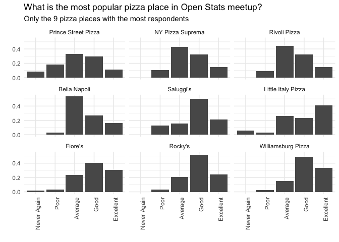
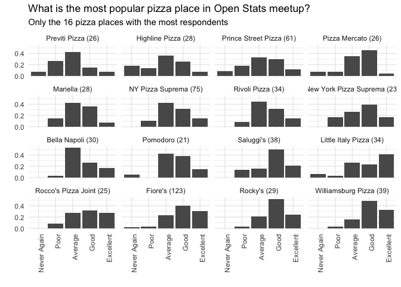

> We are trying to plot the evaluations of each place but also plotting the confidence interval of each evaluation. We first build an auxiliary function to use with our dataset that sums each answer by place. 


```r
# basic setup
library(tidyverse)
```

```
## ── Attaching packages ───────────────────────────────────────────────────────────────────────────────────────────────────────────────────────────────────── tidyverse 1.2.1 ──
```

```
## ✔ ggplot2 3.2.1     ✔ purrr   0.3.2
## ✔ tibble  2.1.3     ✔ dplyr   0.8.3
## ✔ tidyr   1.0.0     ✔ stringr 1.4.0
## ✔ readr   1.3.1     ✔ forcats 0.4.0
```

```
## ── Conflicts ──────────────────────────────────────────────────────────────────────────────────────────────────────────────────────────────────────── tidyverse_conflicts() ──
## ✖ dplyr::filter() masks stats::filter()
## ✖ dplyr::lag()    masks stats::lag()
```

```r
library(knitr) # for kable
library(kableExtra) # to change tables font size
```

```
## 
## Attaching package: 'kableExtra'
```

```
## The following object is masked from 'package:dplyr':
## 
##     group_rows
```

```r
library(glue)
```

```
## 
## Attaching package: 'glue'
```

```
## The following object is masked from 'package:dplyr':
## 
##     collapse
```

```r
theme_set(theme_minimal()) # changing ggplot2 default theme
```


```r
# getting data from github
pizza_jared <- readr::read_csv("https://raw.githubusercontent.com/rfordatascience/tidytuesday/master/data/2019/2019-10-01/pizza_jared.csv")
```

```
## Parsed with column specification:
## cols(
##   polla_qid = col_double(),
##   answer = col_character(),
##   votes = col_double(),
##   pollq_id = col_double(),
##   question = col_character(),
##   place = col_character(),
##   time = col_double(),
##   total_votes = col_double(),
##   percent = col_double()
## )
```

```r
# overal look
pizza_jared %>% 
  head(10) %>% 
  kable() %>% 
  kable_styling(font_size = 11)
```

<table class="table" style="font-size: 11px; margin-left: auto; margin-right: auto;">
 <thead>
  <tr>
   <th style="text-align:right;"> polla_qid </th>
   <th style="text-align:left;"> answer </th>
   <th style="text-align:right;"> votes </th>
   <th style="text-align:right;"> pollq_id </th>
   <th style="text-align:left;"> question </th>
   <th style="text-align:left;"> place </th>
   <th style="text-align:right;"> time </th>
   <th style="text-align:right;"> total_votes </th>
   <th style="text-align:right;"> percent </th>
  </tr>
 </thead>
<tbody>
  <tr>
   <td style="text-align:right;"> 2 </td>
   <td style="text-align:left;"> Excellent </td>
   <td style="text-align:right;"> 0 </td>
   <td style="text-align:right;"> 2 </td>
   <td style="text-align:left;"> How was Pizza Mercato? </td>
   <td style="text-align:left;"> Pizza Mercato </td>
   <td style="text-align:right;"> 1344361527 </td>
   <td style="text-align:right;"> 13 </td>
   <td style="text-align:right;"> 0.0000 </td>
  </tr>
  <tr>
   <td style="text-align:right;"> 2 </td>
   <td style="text-align:left;"> Good </td>
   <td style="text-align:right;"> 6 </td>
   <td style="text-align:right;"> 2 </td>
   <td style="text-align:left;"> How was Pizza Mercato? </td>
   <td style="text-align:left;"> Pizza Mercato </td>
   <td style="text-align:right;"> 1344361527 </td>
   <td style="text-align:right;"> 13 </td>
   <td style="text-align:right;"> 0.4615 </td>
  </tr>
  <tr>
   <td style="text-align:right;"> 2 </td>
   <td style="text-align:left;"> Average </td>
   <td style="text-align:right;"> 4 </td>
   <td style="text-align:right;"> 2 </td>
   <td style="text-align:left;"> How was Pizza Mercato? </td>
   <td style="text-align:left;"> Pizza Mercato </td>
   <td style="text-align:right;"> 1344361527 </td>
   <td style="text-align:right;"> 13 </td>
   <td style="text-align:right;"> 0.3077 </td>
  </tr>
  <tr>
   <td style="text-align:right;"> 2 </td>
   <td style="text-align:left;"> Poor </td>
   <td style="text-align:right;"> 1 </td>
   <td style="text-align:right;"> 2 </td>
   <td style="text-align:left;"> How was Pizza Mercato? </td>
   <td style="text-align:left;"> Pizza Mercato </td>
   <td style="text-align:right;"> 1344361527 </td>
   <td style="text-align:right;"> 13 </td>
   <td style="text-align:right;"> 0.0769 </td>
  </tr>
  <tr>
   <td style="text-align:right;"> 2 </td>
   <td style="text-align:left;"> Never Again </td>
   <td style="text-align:right;"> 2 </td>
   <td style="text-align:right;"> 2 </td>
   <td style="text-align:left;"> How was Pizza Mercato? </td>
   <td style="text-align:left;"> Pizza Mercato </td>
   <td style="text-align:right;"> 1344361527 </td>
   <td style="text-align:right;"> 13 </td>
   <td style="text-align:right;"> 0.1538 </td>
  </tr>
  <tr>
   <td style="text-align:right;"> 3 </td>
   <td style="text-align:left;"> Excellent </td>
   <td style="text-align:right;"> 1 </td>
   <td style="text-align:right;"> 3 </td>
   <td style="text-align:left;"> How was Maffei's Pizza? </td>
   <td style="text-align:left;"> Maffei's Pizza </td>
   <td style="text-align:right;"> 1348120800 </td>
   <td style="text-align:right;"> 7 </td>
   <td style="text-align:right;"> 0.1429 </td>
  </tr>
  <tr>
   <td style="text-align:right;"> 3 </td>
   <td style="text-align:left;"> Good </td>
   <td style="text-align:right;"> 1 </td>
   <td style="text-align:right;"> 3 </td>
   <td style="text-align:left;"> How was Maffei's Pizza? </td>
   <td style="text-align:left;"> Maffei's Pizza </td>
   <td style="text-align:right;"> 1348120800 </td>
   <td style="text-align:right;"> 7 </td>
   <td style="text-align:right;"> 0.1429 </td>
  </tr>
  <tr>
   <td style="text-align:right;"> 3 </td>
   <td style="text-align:left;"> Average </td>
   <td style="text-align:right;"> 3 </td>
   <td style="text-align:right;"> 3 </td>
   <td style="text-align:left;"> How was Maffei's Pizza? </td>
   <td style="text-align:left;"> Maffei's Pizza </td>
   <td style="text-align:right;"> 1348120800 </td>
   <td style="text-align:right;"> 7 </td>
   <td style="text-align:right;"> 0.4286 </td>
  </tr>
  <tr>
   <td style="text-align:right;"> 3 </td>
   <td style="text-align:left;"> Poor </td>
   <td style="text-align:right;"> 1 </td>
   <td style="text-align:right;"> 3 </td>
   <td style="text-align:left;"> How was Maffei's Pizza? </td>
   <td style="text-align:left;"> Maffei's Pizza </td>
   <td style="text-align:right;"> 1348120800 </td>
   <td style="text-align:right;"> 7 </td>
   <td style="text-align:right;"> 0.1429 </td>
  </tr>
  <tr>
   <td style="text-align:right;"> 3 </td>
   <td style="text-align:left;"> Never Again </td>
   <td style="text-align:right;"> 1 </td>
   <td style="text-align:right;"> 3 </td>
   <td style="text-align:left;"> How was Maffei's Pizza? </td>
   <td style="text-align:left;"> Maffei's Pizza </td>
   <td style="text-align:right;"> 1348120800 </td>
   <td style="text-align:right;"> 7 </td>
   <td style="text-align:right;"> 0.1429 </td>
  </tr>
</tbody>
</table>


```r
answer_order <- c("Never Again","Poor", "Average", "Good","Excellent")

by_place_answer <- pizza_jared %>% 
  mutate( time = as.POSIXct(time, origin="1970-01-01"),
          date = as.Date(time),
          answer = fct_relevel(answer, answer_order)) %>% 
  group_by(place, answer) %>% 
  summarise(votes=sum(votes)) %>% 
  mutate(total = sum(votes)) %>% 
  mutate(percent = votes/total,
         answer_integer = as.integer(answer),
         average=sum(answer_integer*percent)) %>% 
  ungroup()

by_place_answer %>% 
  head(10) %>% 
  kable() %>% 
  kable_styling(font_size = 10)
```

<table class="table" style="font-size: 10px; margin-left: auto; margin-right: auto;">
 <thead>
  <tr>
   <th style="text-align:left;"> place </th>
   <th style="text-align:left;"> answer </th>
   <th style="text-align:right;"> votes </th>
   <th style="text-align:right;"> total </th>
   <th style="text-align:right;"> percent </th>
   <th style="text-align:right;"> answer_integer </th>
   <th style="text-align:right;"> average </th>
  </tr>
 </thead>
<tbody>
  <tr>
   <td style="text-align:left;"> 5 Boroughs Pizza </td>
   <td style="text-align:left;"> Never Again </td>
   <td style="text-align:right;"> 0 </td>
   <td style="text-align:right;"> 3 </td>
   <td style="text-align:right;"> 0.0000000 </td>
   <td style="text-align:right;"> 1 </td>
   <td style="text-align:right;"> 3.666667 </td>
  </tr>
  <tr>
   <td style="text-align:left;"> 5 Boroughs Pizza </td>
   <td style="text-align:left;"> Poor </td>
   <td style="text-align:right;"> 0 </td>
   <td style="text-align:right;"> 3 </td>
   <td style="text-align:right;"> 0.0000000 </td>
   <td style="text-align:right;"> 2 </td>
   <td style="text-align:right;"> 3.666667 </td>
  </tr>
  <tr>
   <td style="text-align:left;"> 5 Boroughs Pizza </td>
   <td style="text-align:left;"> Average </td>
   <td style="text-align:right;"> 2 </td>
   <td style="text-align:right;"> 3 </td>
   <td style="text-align:right;"> 0.6666667 </td>
   <td style="text-align:right;"> 3 </td>
   <td style="text-align:right;"> 3.666667 </td>
  </tr>
  <tr>
   <td style="text-align:left;"> 5 Boroughs Pizza </td>
   <td style="text-align:left;"> Good </td>
   <td style="text-align:right;"> 0 </td>
   <td style="text-align:right;"> 3 </td>
   <td style="text-align:right;"> 0.0000000 </td>
   <td style="text-align:right;"> 4 </td>
   <td style="text-align:right;"> 3.666667 </td>
  </tr>
  <tr>
   <td style="text-align:left;"> 5 Boroughs Pizza </td>
   <td style="text-align:left;"> Excellent </td>
   <td style="text-align:right;"> 1 </td>
   <td style="text-align:right;"> 3 </td>
   <td style="text-align:right;"> 0.3333333 </td>
   <td style="text-align:right;"> 5 </td>
   <td style="text-align:right;"> 3.666667 </td>
  </tr>
  <tr>
   <td style="text-align:left;"> Artichoke Basille's Pizza </td>
   <td style="text-align:left;"> Never Again </td>
   <td style="text-align:right;"> 0 </td>
   <td style="text-align:right;"> 10 </td>
   <td style="text-align:right;"> 0.0000000 </td>
   <td style="text-align:right;"> 1 </td>
   <td style="text-align:right;"> 4.100000 </td>
  </tr>
  <tr>
   <td style="text-align:left;"> Artichoke Basille's Pizza </td>
   <td style="text-align:left;"> Poor </td>
   <td style="text-align:right;"> 1 </td>
   <td style="text-align:right;"> 10 </td>
   <td style="text-align:right;"> 0.1000000 </td>
   <td style="text-align:right;"> 2 </td>
   <td style="text-align:right;"> 4.100000 </td>
  </tr>
  <tr>
   <td style="text-align:left;"> Artichoke Basille's Pizza </td>
   <td style="text-align:left;"> Average </td>
   <td style="text-align:right;"> 1 </td>
   <td style="text-align:right;"> 10 </td>
   <td style="text-align:right;"> 0.1000000 </td>
   <td style="text-align:right;"> 3 </td>
   <td style="text-align:right;"> 4.100000 </td>
  </tr>
  <tr>
   <td style="text-align:left;"> Artichoke Basille's Pizza </td>
   <td style="text-align:left;"> Good </td>
   <td style="text-align:right;"> 4 </td>
   <td style="text-align:right;"> 10 </td>
   <td style="text-align:right;"> 0.4000000 </td>
   <td style="text-align:right;"> 4 </td>
   <td style="text-align:right;"> 4.100000 </td>
  </tr>
  <tr>
   <td style="text-align:left;"> Artichoke Basille's Pizza </td>
   <td style="text-align:left;"> Excellent </td>
   <td style="text-align:right;"> 4 </td>
   <td style="text-align:right;"> 10 </td>
   <td style="text-align:right;"> 0.4000000 </td>
   <td style="text-align:right;"> 5 </td>
   <td style="text-align:right;"> 4.100000 </td>
  </tr>
</tbody>
</table>


```r
# by place
by_place_answer %>% 
  # with at least 29 evaluations (cabalistic number to show 9 facets!)
  filter(total >= 29) %>% 
  # controls the order of the facets (worst->better)
  mutate(place = fct_reorder(place, average)) %>%  
  ggplot(aes(answer, percent)) +
  geom_col() +
  facet_wrap(~place) +
  theme(axis.text.x=element_text(angle=90, hjust = 1)) +
  labs(x="", y="",
       title="What is the most popular pizza place in Open Stats meetup?",
       subtitle="Only the 9 pizza places with the most respondents")
```

<!-- -->


```r
by_place_answer %>% 
  # trick to choose "top N"
  # reorder by total de votes in reverse order
  # convert to integer and get "rank" <= N
  filter(as.integer(fct_reorder(place, total, .desc = T))<=16,
         answer!="Fair") %>% # there just one vote with answer 'fair'
  mutate(place = glue("{place} ({total})"), # number of samples
         place = fct_reorder(place, average)) %>% 
  ggplot(aes(answer, percent)) +
  geom_col() +
  facet_wrap(~place) +
  theme(axis.text.x=element_text(angle=90, hjust = 1)) +
  labs(x="", y="",
       title="What is the most popular pizza place in Open Stats meetup?",
       subtitle="Only the 16 pizza places with the most respondents")
```

<!-- -->


```r
# generate a sample from 'x' with each 'frequency'
# then apply a t.test
t_test_repeated <- function(x,frequency){
  tidy(t.test(rep(x,frequency)))
}

# check
t_test_repeated(c(1,2,3,4,5),c(5,10,100,50,30))
```


