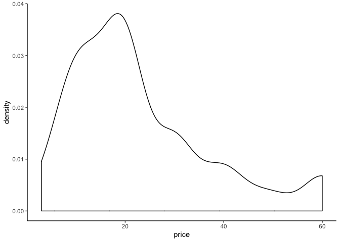

```r
library(readr)
library(tidyverse)
library(lubridate)
library(skimr) 
library(naniar) 
```

> Data: 
https://github.com/rfordatascience/tidytuesday/tree/master/data/2019/2019-07-30
This dataset seems pretty interesting and straightforward


```r
library(readr)
video_games <- read_csv("~/Desktop/Compsci-final/video_games.csv")

video_games[video_games==0] <- NA
vg_clean<-video_games %>% 
  drop_na() 
```

> Ideas:
Video games

> Graphs/Tables:


```r
vg_clean %>% 
  ggplot(aes(x = price))+
  geom_density() +
  theme_classic()
```

<!-- -->

```r
top_ten_avrplaytime_game <- vg_clean %>% 
  select(game, average_playtime) %>% 
  arrange(desc(average_playtime)) %>% 
  top_n(10)
```

```
## Selecting by average_playtime
```

```r
top_ten_avrplaytime_game
```

```
## # A tibble: 10 x 2
##    game                                           average_playtime
##    <chr>                                                     <dbl>
##  1 FINAL FANTASY XIV Online                                   4461
##  2 Alan Wake                                                  4106
##  3 Nioh: Complete Edition / 仁王 Complete Edition             2904
##  4 A Story About My Uncle                                     2830
##  5 Battle Brothers                                            2464
##  6 The Descendant                                             2313
##  7 Football Manager 2019                                      2220
##  8 The Sims 3                                                 2156
##  9 Muv-Luv Alternative                                        2079
## 10 HITMAN 2                                                   2053
```


