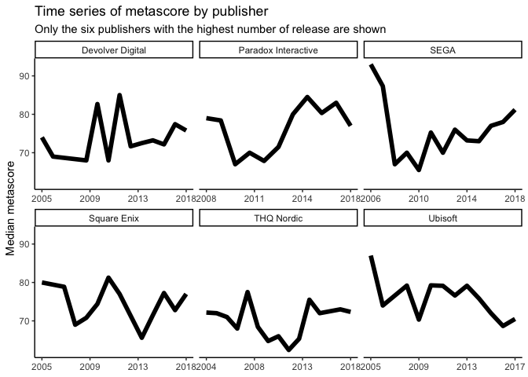
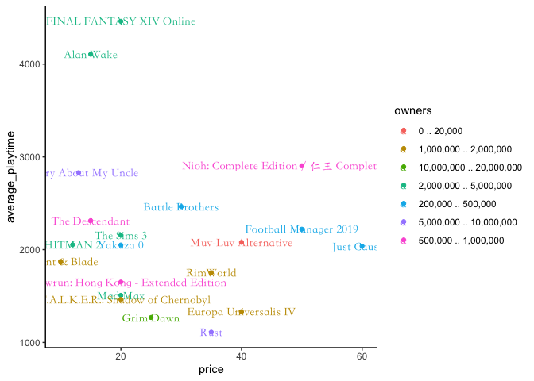

```r
library(readr)
library(tidyverse)
library(lubridate)
library(skimr) 
library(naniar) 
library(ggmap)
library(gplots) 
library(RColorBrewer) 
library(sf) 
library(leaflet)
library(formattable)
```

## Dataset 1: nyc_squirrels 

> **Dataset**:


```r
nyc_squirrels <- readr::read_csv("https://raw.githubusercontent.com/rfordatascience/tidytuesday/master/data/2019/2019-10-29/nyc_squirrels.csv")
```

> **Ideas:** we could find out the squirals habits like runnig, chasing, eating, e.t.c., and we can also find the specific differences among different specific locations in NYC.  

> **Graph and Table**


```r
dates<-nyc_squirrels %>% 
  group_by(date) %>% 
  summarise(num = n())
```

> This table shows the number of squirrels recorded in days in October, 2018


```r
formattable(dates,align =c("c", "c"), list(`Indicator Name` = formatter("span", style =~style(color = "black",font.weight = "bold"))))
```


<table class="table table-condensed">
 <thead>
  <tr>
   <th style="text-align:center;"> date </th>
   <th style="text-align:center;"> num </th>
  </tr>
 </thead>
<tbody>
  <tr>
   <td style="text-align:center;"> 10062018 </td>
   <td style="text-align:center;"> 337 </td>
  </tr>
  <tr>
   <td style="text-align:center;"> 10072018 </td>
   <td style="text-align:center;"> 405 </td>
  </tr>
  <tr>
   <td style="text-align:center;"> 10082018 </td>
   <td style="text-align:center;"> 285 </td>
  </tr>
  <tr>
   <td style="text-align:center;"> 10102018 </td>
   <td style="text-align:center;"> 335 </td>
  </tr>
  <tr>
   <td style="text-align:center;"> 10122018 </td>
   <td style="text-align:center;"> 218 </td>
  </tr>
  <tr>
   <td style="text-align:center;"> 10132018 </td>
   <td style="text-align:center;"> 434 </td>
  </tr>
  <tr>
   <td style="text-align:center;"> 10142018 </td>
   <td style="text-align:center;"> 368 </td>
  </tr>
  <tr>
   <td style="text-align:center;"> 10172018 </td>
   <td style="text-align:center;"> 216 </td>
  </tr>
  <tr>
   <td style="text-align:center;"> 10182018 </td>
   <td style="text-align:center;"> 200 </td>
  </tr>
  <tr>
   <td style="text-align:center;"> 10192018 </td>
   <td style="text-align:center;"> 158 </td>
  </tr>
  <tr>
   <td style="text-align:center;"> 10202018 </td>
   <td style="text-align:center;"> 67 </td>
  </tr>
</tbody>
</table>


```r
temp <- nyc_squirrels %>% 
  select(lat, long, eating) %>% 
  group_by(lat, long) %>% 
  summarise(eating = sum(eating))

temp[temp==0] <- NA
eating_squirrels<-temp %>% 
  drop_na() 

paleating <- colorFactor(c("Red"), 
                     domain = eating_squirrels$eating) 

eating_map <- leaflet(eating_squirrels) %>% 
  addProviderTiles(providers$CartoDB.DarkMatter) %>%
  addCircleMarkers(lng = ~long, lat = ~lat, color = ~paleating(eating), stroke = FALSE, fillOpacity = 0.5, radius = 1.4) %>% 
  addLegend(pal = paleating, 
            values = ~eating, 
            opacity = 0.5, 
            title = NULL,
            position = "bottomright") 
```

> This map shows all places that squirals have eaten at on some days in October, 2018.


```r
eating_map
```

<!--html_preserve--><div id="htmlwidget-f4ec6429787ad9b10d11" style="width:672px;height:480px;" class="leaflet html-widget"></div>
<script type="application/json" data-for="htmlwidget-f4ec6429787ad9b10d11">{"x":{"options":{"crs":{"crsClass":"L.CRS.EPSG3857","code":null,"proj4def":null,"projectedBounds":null,"options":{}}},"calls":[{"method":"addProviderTiles","args":["CartoDB.DarkMatter",null,null,{"errorTileUrl":"","noWrap":false,"detectRetina":false}]},{"method":"addCircleMarkers","args":[[40.7650077086539,40.7652951714745,40.7653097139415,40.7653888351839,40.7654285510067,40.7656171832911,40.7656337147768,40.7656644063024,40.7657854684194,40.7658376729234,40.7659043693008,40.7659842666881,40.7660637295671,40.766070446642,40.7660946071574,40.7661199889431,40.7661907261547,40.7662231892125,40.7662642413761,40.7663168362582,40.766371971273,40.7664351724309,40.7665584681025,40.7667971476099,40.7668205976986,40.7668696411765,40.7668839966177,40.7669349368183,40.7669614322613,40.7669673778105,40.7670816164986,40.7672758037086,40.7673305056277,40.7675056025357,40.7675202157155,40.7675726965985,40.7676126748454,40.7676321060669,40.7676540772339,40.7676583475394,40.7676793289765,40.7676902603543,40.7677411911854,40.7677455633932,40.7677698656935,40.7677782585639,40.767836440957,40.7678702158382,40.7678723471007,40.7679049871186,40.7679111971294,40.7679259390448,40.7679326548845,40.7679895093963,40.7679989116642,40.7680159511705,40.7680335996527,40.7680931566797,40.7681097168268,40.7681421869407,40.7681481183296,40.7681537966505,40.7681954366911,40.7682187144432,40.7683223242143,40.7683335292642,40.768336388516,40.768387910254,40.7683896665502,40.7683925377714,40.7684217215595,40.7684314285151,40.7684390015166,40.7684820679479,40.768577844752,40.7685934093915,40.7685998275864,40.7686218881386,40.7686520352868,40.7686791169776,40.7687061447032,40.7687265606227,40.7687267327113,40.7687330473562,40.7687376032936,40.7687880243986,40.7688048644871,40.768876248561,40.7688839576487,40.768895893226,40.768902033819,40.7689416540228,40.7689419765393,40.768951107763,40.7689824531444,40.7690114585688,40.7690128009722,40.7690147873986,40.7690453494383,40.7690820276888,40.769109895294,40.7691479781207,40.7691512453402,40.7691801644292,40.7691980808067,40.7692014637698,40.7692693139328,40.7692776896995,40.7693499326095,40.7694125671679,40.7694236097224,40.7694484997295,40.7694522315322,40.7694886645194,40.7695511718541,40.7695584933538,40.7695885530701,40.7695941843825,40.7695971164981,40.7696367609606,40.7696404489025,40.7696506688861,40.7696870806229,40.7696998327247,40.7697007833531,40.7697011100487,40.7697167828003,40.7697207404744,40.7697372811949,40.7697373141498,40.7697559231927,40.7697569149388,40.7697788641081,40.7698034314993,40.7698230936583,40.7698324659513,40.7698499183436,40.7698763846186,40.7699378332299,40.7699558513225,40.7699948746776,40.7700650799886,40.7700678919108,40.7700916895929,40.7701071405918,40.7701092834201,40.7701125773248,40.7701294635264,40.7701978146968,40.7701979377103,40.7702891474555,40.7703284894392,40.7704051056666,40.7704083288013,40.7704671295941,40.7704727212299,40.7704928300008,40.7705198722028,40.7705202790525,40.7705452529783,40.7705523372364,40.7705619840715,40.770579297644,40.7705999588222,40.7706121151491,40.7706540698938,40.7707024146365,40.7707167671865,40.7707256124181,40.7707561532949,40.7707837657859,40.770807701562,40.7708133986192,40.7708581562057,40.7708936173356,40.7709033697887,40.7709484964577,40.7709677983247,40.7711057827923,40.7711445841928,40.7711472794488,40.7711846894166,40.7712143385426,40.7712709366093,40.7712983658944,40.7713732567512,40.7714036487747,40.7714445258765,40.7714466633386,40.7715638228207,40.7715726159383,40.7715896672335,40.7716072681474,40.771611393182,40.7716297491384,40.7716763799299,40.7716931127716,40.7717032986885,40.7717074044466,40.7717400139502,40.771760114722,40.7717766893833,40.7718177667511,40.7719703235178,40.7720350191273,40.7720833097065,40.7720905395472,40.7721127748427,40.7721754848905,40.7722062991044,40.7722445210179,40.7722754599865,40.7722869065638,40.7722933513053,40.7723138521327,40.7723310150843,40.7723417173451,40.772362045852,40.7723666382125,40.7723889726647,40.7724091146678,40.7724155751282,40.7724853142211,40.7725660224983,40.7725756707748,40.7726060987821,40.7726200054197,40.7726424441344,40.7726669278308,40.7726685284831,40.7726867422002,40.7726873760687,40.772699885583,40.7728284025195,40.7728617837174,40.773038298158,40.7730688398468,40.7731347452245,40.7731515721826,40.7731716665766,40.7732060035215,40.7732399463626,40.7732949090005,40.773313866931,40.7733240612552,40.7733537881363,40.7733646782679,40.7734575166319,40.7735074437085,40.7735818387346,40.7736180793606,40.7736889979965,40.773709213914,40.7737313251559,40.7737340720562,40.7738473490681,40.7738535171265,40.7740672862953,40.7740994735325,40.7741018274312,40.7741105688757,40.7741422177187,40.7741627220859,40.7741908010484,40.7742043234014,40.7742119240825,40.7742186391935,40.7742591029151,40.7742695912,40.7742783484486,40.7742857042581,40.7742862219469,40.7743256716496,40.7743391883762,40.7743474675821,40.7744028820163,40.7744163768061,40.774446589038,40.7744535798123,40.7744877026506,40.7744996336934,40.7745000645436,40.7745023355775,40.7745386896959,40.7745520717065,40.7745700102115,40.7745938268705,40.7746153066601,40.774621784862,40.7746876635248,40.7748000962909,40.7748155701122,40.7748300991287,40.7748467061969,40.7748584798761,40.7748805439381,40.7748894266027,40.7749628597465,40.7750175306716,40.775032271482,40.7750691120996,40.7750878657618,40.775164077652,40.7752422758202,40.7752456763263,40.7752662550312,40.7753169595373,40.7753262103123,40.7753405377869,40.7753462013506,40.7753465489231,40.7753505024976,40.7753731930704,40.7753795014815,40.7753915552001,40.7754674678574,40.7754704051391,40.7755119810678,40.7755181941559,40.7755567428199,40.7755625717273,40.7755877312075,40.7755898126674,40.7755950428973,40.7756090404121,40.7756180893318,40.7756257458036,40.775645134229,40.7756523577509,40.7757055884538,40.7757060731026,40.7757530583569,40.7757541971012,40.775770422667,40.7758322627711,40.7758611111219,40.7758743113817,40.7759094917104,40.7759229213762,40.7759469280872,40.7760015129298,40.7760275250114,40.7760432720017,40.7760553338671,40.7760872452093,40.7761092972965,40.7761115392738,40.7761311465857,40.7761532088521,40.7762145993937,40.7762329714016,40.7762349924081,40.7762359066591,40.7762491903691,40.7762719619467,40.7762756593015,40.776288410765,40.7763194425467,40.7763203164339,40.7763606494306,40.7763749561607,40.7763755560359,40.7764444385452,40.7764608087703,40.7765009796853,40.7765816261518,40.7765857838015,40.7765899724756,40.7765964740768,40.7765973509721,40.7766014124609,40.7766356226979,40.7766518221998,40.7766770153764,40.7766940405403,40.7767162824413,40.7767389791452,40.776760392858,40.7767695507462,40.7767834276767,40.7767916587915,40.7768100147333,40.7768771349868,40.7770454318226,40.7770639340582,40.7772180370053,40.7772566833799,40.777259393859,40.7773012642758,40.7773053099657,40.7773163388327,40.7773289724189,40.7773554311586,40.7773631337117,40.7773757069445,40.7774506065008,40.7774976423922,40.7775003050028,40.7775286924617,40.7775556986702,40.7776218260789,40.777641740817,40.7776953065849,40.7777373345558,40.7778169845999,40.7778691433218,40.7780656588337,40.77809016436,40.7781330751738,40.7781658424866,40.7782157459155,40.7782728130401,40.7783693690954,40.7783790991192,40.7784370719371,40.7784669316504,40.7785039981892,40.7785245025508,40.778534830257,40.7785583630323,40.778584776139,40.7786375267659,40.7786455091699,40.7786545659072,40.7786640676355,40.7786749596774,40.7786823090663,40.7786860108302,40.7787016773517,40.7787466095841,40.7787526130321,40.7787735291442,40.7787752287055,40.7787780193358,40.7787872561177,40.7788600242549,40.778926988884,40.7790131966689,40.7790583544252,40.7791203699027,40.779136518298,40.7791544102422,40.7791683666215,40.7792767850126,40.779321901098,40.7793670703727,40.7794514526463,40.7795319556023,40.7795591281979,40.7796357444471,40.7796399955868,40.7796462634184,40.7796704898979,40.7797516688844,40.7798049470745,40.7798470142991,40.7798863522904,40.7798965621203,40.780193490343,40.7802675743233,40.7802926111865,40.7803482448467,40.7803527061859,40.7804347548303,40.780519159069,40.7805339953372,40.7805662180672,40.7806136565784,40.7807271518813,40.7808289765857,40.7809187761995,40.7809719445309,40.780992836417,40.7809990098597,40.7810042827198,40.7810151087286,40.7810450065235,40.7810666805133,40.7810680044024,40.7810709818696,40.7810785055136,40.7810842503715,40.7811164976329,40.781183828857,40.7813477352507,40.781351011968,40.7813537959435,40.7813829172072,40.7814068507607,40.7815277479588,40.7815652353937,40.7817423907284,40.7818586173755,40.7819082838334,40.7819296887147,40.7819356810575,40.7820439983567,40.7820810673532,40.7821064183815,40.7821632293136,40.782206970617,40.7823874581829,40.7824346548278,40.7825083721362,40.7825429441583,40.7825966332367,40.7826333686599,40.782877291358,40.7828950272904,40.7829225326288,40.7830532310766,40.7833659689194,40.7835947167436,40.7836775064883,40.7836929044459,40.7837103696906,40.7838472644815,40.7838870159057,40.783913304529,40.7839613907139,40.7840083040604,40.7840492606552,40.7840678890949,40.7840721191988,40.784115697669,40.7841298584027,40.7842607168578,40.7843300758044,40.7845301288163,40.7845473505585,40.7850256219415,40.7853134751509,40.7853358193723,40.7854119342538,40.7868659490397,40.7869888639434,40.7870781042595,40.7875347862766,40.7882333830729,40.7884180156055,40.7885764284016,40.7886373772305,40.788637452988,40.7886962740167,40.7889533029466,40.7890284642399,40.7891042935432,40.7891945123815,40.789573183584,40.789806297824,40.789911786416,40.7899151873467,40.7899152327912,40.7899295439265,40.7899599350145,40.7900337598704,40.790044098464,40.790075966587,40.7901473714024,40.7901506706248,40.7901572818776,40.7902456668332,40.7902529354639,40.7902770710643,40.7902777556926,40.7903128889029,40.7903365788694,40.7903443029725,40.7903826659569,40.7904324693292,40.7904390691553,40.7904737110761,40.7904796216068,40.7905208345549,40.7905219388359,40.7905225147022,40.7905923765213,40.7906047630418,40.7906166981409,40.7906180969472,40.7906520520417,40.7906612313673,40.7906686504657,40.7907059424675,40.7907073888277,40.790786197111,40.7908084039886,40.7908193284981,40.790858199891,40.7908677445466,40.7909532437095,40.7909769801241,40.7910100435196,40.7910157676119,40.7910284106931,40.7910513041359,40.7910635810038,40.7911211164754,40.7911589002217,40.7912068380845,40.7912082086879,40.7912119940469,40.7912272455454,40.7912472380247,40.7912631913057,40.7912681060756,40.7912807969365,40.7912866208106,40.7912917391867,40.7912992852442,40.7913464147989,40.7913532129148,40.7914073632782,40.7914179994956,40.7914467650712,40.791449395909,40.7914829661051,40.7914844989865,40.7915250069086,40.7915477304252,40.7917243850136,40.7917265419842,40.7917273773486,40.7917320450401,40.7917685404482,40.7918074743129,40.7918244310746,40.7918743735665,40.7918992406575,40.7919612446005,40.7919745085986,40.7920963446605,40.7921270121312,40.7921404951324,40.7922056218325,40.7922896176936,40.7922919074537,40.7924167234441,40.7924173263904,40.7924789548522,40.7925800181543,40.7925807808307,40.7927644594513,40.7930353817441,40.7930697207834,40.7930844158021,40.793091234605,40.7931497452294,40.7932014159087,40.7932034409546,40.7932564163328,40.7932879745739,40.7932880937406,40.7932886803231,40.7933777553406,40.7934359372871,40.7935398008612,40.7937382705056,40.7937473968735,40.7938048572403,40.7938167628067,40.7938449345017,40.7938634280159,40.7938724278575,40.7938845572816,40.7939340053805,40.7939505791448,40.7941677113011,40.7942427079733,40.7943086530436,40.7943801121036,40.7944097368153,40.7945051962914,40.7945150173918,40.7945269936639,40.7945464262112,40.7945503341011,40.7946365810826,40.7946803725236,40.7947329828155,40.7947437983977,40.7947587726617,40.7947639241491,40.7947887062326,40.7947945266515,40.7948117428147,40.7948785497717,40.7949188960194,40.7949231000186,40.794937340845,40.7949440648632,40.7949526729608,40.7949568873453,40.794964729747,40.7950071252836,40.7954126939561,40.7954469678857,40.7954551238146,40.7954687648248,40.7954915417553,40.7955350609057,40.7956055442,40.7956624328733,40.7957285542564,40.7957981310897,40.7959039949577,40.7959176317705,40.7959337795027,40.7959810622342,40.7960413520131,40.7960622445291,40.7960663442573,40.7961036981921,40.7961254697958,40.796126044521,40.7961701874769,40.7961707624534,40.7961869951798,40.7961896477077,40.796349417475,40.7963721679474,40.7963918051751,40.7964417084985,40.796517007214,40.7965342664074,40.7965525296722,40.7965668878961,40.7969645476349,40.797027128241,40.7971235333699,40.797225436004,40.797298837759,40.7973085844087,40.7973128653773,40.7974407641075,40.7974442913898,40.7977320341094,40.7977549157287,40.7977720808005,40.7978975855555,40.7979800395433,40.7980080911115,40.7980121226635,40.7980460204041,40.7981257651433,40.7982597947515,40.7983069118579,40.7984457363388,40.798525897229,40.7985282963244,40.7985706143519,40.7986011403785,40.7986549251083,40.7986940168685,40.7988549523022,40.7992037821497,40.799225295679,40.7993692120774,40.7994216061391,40.7997708190022],[-73.9740007759509,-73.9728146482385,-73.9734630412566,-73.9747313152152,-73.972757765574,-73.97348276186,-73.9733905460282,-73.9756573579063,-73.9734206435334,-73.9725157534356,-73.972248505758,-73.9728700359494,-73.9728360875598,-73.9764601882854,-73.9765877920583,-73.9767314435027,-73.9766195697096,-73.9761375729505,-73.9752673884392,-73.9744390217386,-73.9765386965371,-73.9746965894947,-73.9750688083336,-73.9721210372896,-73.9757215415855,-73.9772396728545,-73.9784610031588,-73.9786310308892,-73.9757673193743,-73.9766779585686,-73.9728723853967,-73.9729105002306,-73.9749641575871,-73.9733545802515,-73.9789385196073,-73.9743369068254,-73.9787736280005,-73.97780296909,-73.9802983138318,-73.9791217510656,-73.9758375334287,-73.9711298491132,-73.978400938697,-73.9801007327506,-73.9801651470389,-73.9800094828465,-73.9801956082236,-73.980854228628,-73.9802079259866,-73.9796409671481,-73.9749251267433,-73.9793565564361,-73.9758579666874,-73.9772576561244,-73.9805927710872,-73.9801985977846,-73.9756017589251,-73.9779805668091,-73.9806377967573,-73.9754709117681,-73.9804065254162,-73.9806805581636,-73.9760298241178,-73.9710207438538,-73.9809876538513,-73.9807078515193,-73.9754790964561,-73.9794371709817,-73.9809610117171,-73.9810149147578,-73.9709242364673,-73.9733461334967,-73.9769693140651,-73.9806959248152,-73.9791826197108,-73.9790980124501,-73.9761223919286,-73.9734605176646,-73.974467903723,-73.9790214253443,-73.9735753352129,-73.9809342290598,-73.9801562527339,-73.9733820053679,-73.9753291616796,-73.9743970455533,-73.9790896775237,-73.9763852372393,-73.9763116425885,-73.9795585338537,-73.9706533131129,-73.9705509170542,-73.9787658435198,-73.9702717260829,-73.973230162241,-73.9787015184662,-73.972154069981,-73.9761447791484,-73.9773821135611,-73.9786940945874,-73.9735137178369,-73.9745141185576,-73.9801343393329,-73.9742973420446,-73.9696274291417,-73.9700264128414,-73.9789687905912,-73.9806718258385,-73.9704575848926,-73.9758959798289,-73.9782940231149,-73.9702788578386,-73.9762348224648,-73.9714789136757,-73.9701408623121,-73.9715466850324,-73.9712876234172,-73.9761776424664,-73.9771847728747,-73.9713379914423,-73.9754794191553,-73.9773079154219,-73.9786714207307,-73.9754742295091,-73.9698044218476,-73.9771696835698,-73.977447585355,-73.9772908667333,-73.9786481009499,-73.9789401448556,-73.9786805884996,-73.9755643404768,-73.9694166642262,-73.9799155966086,-73.9779760874355,-73.9695655231393,-73.97055600791,-73.9721263050502,-73.9728895595977,-73.9789251806378,-73.9744906832678,-73.974515099169,-73.9692676659807,-73.9722265046794,-73.9787312025627,-73.9725844658514,-73.970465600402,-73.974451175321,-73.9799594281222,-73.9703732649257,-73.9722359401242,-73.9760749752948,-73.9777124331985,-73.9722281263634,-73.9763622269272,-73.970795746101,-73.9775865217038,-73.9697277998257,-73.9696173677837,-73.97016933635,-73.9763894759543,-73.969560591279,-73.970138810251,-73.970252675331,-73.9763836740342,-73.9738481771673,-73.9789971286844,-73.9742804552383,-73.9755259087781,-73.9769887473852,-73.9793952066038,-73.9773858189627,-73.9774584305147,-73.9773898301093,-73.9769885189342,-73.979381450452,-73.9729410488021,-73.9771614686616,-73.9760880070186,-73.9684092812839,-73.9698246369929,-73.9738033257473,-73.9736489041867,-73.9738817388158,-73.9728871061191,-73.9737091707831,-73.97035767623,-73.9791767156268,-73.9790822606486,-73.973552877209,-73.9717580228664,-73.9782351435852,-73.9735655529245,-73.9763506612375,-73.9734695768004,-73.9698959071826,-73.9736418085696,-73.9707542189896,-73.9706360005275,-73.9714653576023,-73.9716414586381,-73.9754822938869,-73.9784144867639,-73.971086588091,-73.9699369796844,-73.9786898656279,-73.970315671921,-73.9785300509908,-73.9702382274798,-73.9699513151755,-73.9750911996499,-73.9734969320943,-73.9721656413591,-73.973394428186,-73.9719109949232,-73.9729645190377,-73.975062146111,-73.9706949930717,-73.9771843912229,-73.9710991123992,-73.9729142912203,-73.9735946835545,-73.9728654439465,-73.9737060043988,-73.9709991016317,-73.9677500862135,-73.9767247593654,-73.9737329655838,-73.968004352343,-73.9708002461415,-73.9681960138614,-73.9706903740547,-73.9719359643975,-73.9745953710328,-73.9686551213305,-73.9690211935346,-73.9730039581521,-73.9746802194012,-73.9744080700098,-73.9772239251936,-73.9751056714758,-73.9770273553525,-73.9770119133023,-73.9746933852572,-73.9759432151552,-73.9756533763813,-73.9756870789187,-73.9766354967197,-73.9767369686171,-73.976422624924,-73.9759163300535,-73.976716425804,-73.976730206737,-73.9767141407274,-73.9764850086767,-73.9763433202401,-73.9678774314725,-73.9765016413674,-73.9765417282001,-73.9730115687964,-73.969720780557,-73.9696688162449,-73.9744488584414,-73.976769659152,-73.9745305540008,-73.9677474313377,-73.9697855573137,-73.9748635473782,-73.9677387336667,-73.9678154033099,-73.9700666654946,-73.9716621112698,-73.9729394928432,-73.9750992564362,-73.9724681269526,-73.9700066659086,-73.9724083320538,-73.9699134052609,-73.9714242426496,-73.9685709455958,-73.9693465383617,-73.9698130452581,-73.9747963162162,-73.9695305996721,-73.9712971568288,-73.9694938608335,-73.9674984567017,-73.9715921982161,-73.9715251156965,-73.9765269282059,-73.9719194877439,-73.9669206605745,-73.9718270820347,-73.9746229094643,-73.9718553361982,-73.971730277301,-73.9720174997123,-73.974420668782,-73.9762494239719,-73.9703621616472,-73.9663961415789,-73.9671851611243,-73.9762246600197,-73.9711751356843,-73.965509576403,-73.9666113598566,-73.9699517492486,-73.9767220179725,-73.966824257293,-73.9670432105975,-73.9657480066074,-73.9670858934045,-73.9717469822209,-73.9713070217071,-73.9698611971209,-73.9743165321099,-73.9757313481982,-73.9757536187319,-73.9651754464439,-73.9657040391563,-73.9744226682925,-73.9761579527932,-73.9694240327509,-73.9697744662785,-73.9743292066413,-73.9664054327771,-73.9756810453606,-73.9663977261879,-73.9658867660358,-73.9693338657183,-73.9699763667769,-73.9661694463488,-73.9695305555392,-73.9686816795392,-73.9698817079185,-73.970804709441,-73.9653279069888,-73.9697665830132,-73.9706641770728,-73.9737247632185,-73.9653142636891,-73.9714512125212,-73.9690175838534,-73.9711634340673,-73.9710801547498,-73.9705092958892,-73.9651217998407,-73.972212563004,-73.9708798496132,-73.9695518341907,-73.9720365327715,-73.970173142921,-73.9700158929437,-73.9680774548516,-73.9713257586372,-73.969951118124,-73.9674978826751,-73.9676732725672,-73.9691821206863,-73.9705254801,-73.9720289863666,-73.970442878377,-73.9693462354257,-73.9705409446299,-73.9695133370801,-73.9684752839242,-73.9699573485164,-73.9700879096644,-73.9709534894049,-73.9691057326088,-73.9690540696008,-73.969058856545,-73.9694591667705,-73.9689504114652,-73.969784066769,-73.9690362384597,-73.9692946938852,-73.9691094942294,-73.9708969246276,-73.9689657039917,-73.9714089647431,-73.9668140804066,-73.9674724790652,-73.9742986032935,-73.9700861859051,-73.9699188544459,-73.9645147011741,-73.970033345821,-73.9699675160516,-73.9712318712643,-73.9697471123497,-73.967334936601,-73.9709817796369,-73.9686304581526,-73.9710531485298,-73.9692925815903,-73.9714150090362,-73.9639700434449,-73.9653343572865,-73.9636476467218,-73.9697109398302,-73.9676191846985,-73.9639024988123,-73.9639048209454,-73.9673129010312,-73.9701634768603,-73.9707245013626,-73.9684254196866,-73.9730926233232,-73.9686056085297,-73.9645989003589,-73.9673490137465,-73.9674931070324,-73.9712265022781,-73.967042958599,-73.9698642668906,-73.9711865134364,-73.9673803508629,-73.9657721715305,-73.9703149829421,-73.9703314162405,-73.9673821557469,-73.969756965598,-73.9696360756453,-73.9731113265165,-73.9673235555321,-73.9657487923637,-73.9704677007779,-73.9727310397798,-73.9711001278389,-73.9703781726172,-73.9694784056618,-73.967181612203,-73.9700148248402,-73.9661361310677,-73.9687933229572,-73.97186968288,-73.9724801784201,-73.9646610347972,-73.9646495450499,-73.9669432929573,-73.9697178769788,-73.9659010238417,-73.9669207809051,-73.9667911565238,-73.9643664403785,-73.9643032554205,-73.964274290774,-73.9642988690682,-73.9706586108006,-73.9648195433192,-73.9716271494641,-73.9658443548822,-73.9659034359706,-73.9714787178201,-73.9713519158027,-73.9654397484763,-73.9704402681017,-73.9653311136561,-73.9695117797648,-73.9696119179789,-73.9676113345824,-73.9701023478746,-73.9665572004288,-73.969485639023,-73.9653575758687,-73.9694066600156,-73.9647247254127,-73.9661570478029,-73.96393252683,-73.9649632550828,-73.9688271202401,-73.9634563222926,-73.9660110060416,-73.972179947936,-73.9682830510954,-73.9638270331336,-73.9672127283283,-73.9646023053207,-73.9659156108069,-73.9625205538171,-73.9718234159557,-73.9648167334089,-73.9651591861399,-73.9675634326877,-73.9674930668431,-73.9641971813967,-73.9644293195773,-73.9697196619878,-73.9700162034073,-73.9642967875857,-73.9686413326172,-73.9703705008688,-73.9651817987035,-73.9652357279671,-73.9627661465376,-73.9642288873015,-73.9696001184129,-73.964868521585,-73.9630820577441,-73.9635606199784,-73.9672152696834,-73.967466716152,-73.9663168490265,-73.9708083587471,-73.9638298997554,-73.9705260103239,-73.9600204328201,-73.9638397790384,-73.9638141923763,-73.9692660977515,-73.9659549963516,-73.9675472064204,-73.9665871993517,-73.97002473509,-73.9679538163341,-73.968367485157,-73.9671306431211,-73.9690447463294,-73.9689586689061,-73.9594986107981,-73.9594529310985,-73.9594357049738,-73.969370141813,-73.9594391759139,-73.9668909481942,-73.9698446365683,-73.9662895079734,-73.9688454483585,-73.9690079924094,-73.9587072763996,-73.9690266660317,-73.9690104245067,-73.967097592707,-73.9576530157255,-73.9676370985166,-73.9668442742942,-73.9573119777312,-73.9667560049684,-73.9628041577934,-73.9630990823243,-73.9622050752008,-73.9620719414292,-73.965738547469,-73.9552595564798,-73.9662804925774,-73.9662409997642,-73.9661108248377,-73.9639505810228,-73.9578924882613,-73.959514034869,-73.9547878025303,-73.9639941227864,-73.9640989602986,-73.9595645962539,-73.9639635134738,-73.9640588919446,-73.9636027664439,-73.9605554843228,-73.9607280801601,-73.9636551433178,-73.958369699409,-73.9635412640983,-73.9584950620879,-73.9584106786233,-73.9596413903948,-73.9595002339508,-73.9597648775789,-73.9638312025305,-73.9643507588008,-73.9592103064327,-73.9637824756607,-73.9643016116839,-73.9626881234742,-73.9615516703494,-73.9630054996358,-73.9594204646985,-73.9590868748584,-73.9590191812452,-73.9631045499811,-73.9589698681439,-73.9596271142953,-73.9608757424052,-73.9590074024938,-73.9589414339242,-73.9613780522542,-73.9545799024508,-73.9589249555235,-73.9551639847466,-73.9639431360458,-73.9639832886071,-73.9601215198114,-73.9603302382958,-73.9602398690946,-73.9604083891356,-73.9640945609381,-73.9602913105578,-73.9584561537421,-73.9647904085226,-73.9584661589182,-73.9621253644004,-73.9612658688914,-73.9584064203778,-73.9626527908786,-73.9588358879692,-73.9647151303629,-73.9635140434993,-73.9544553697736,-73.9612900553755,-73.9584064190878,-73.9562350820255,-73.9638774579549,-73.9583477850634,-73.9605163698302,-73.9589254878322,-73.9639888092327,-73.9610705592868,-73.9630822385425,-73.9611274898661,-73.96388775887,-73.960601067176,-73.960642602756,-73.9537356145842,-73.9606817053484,-73.9634623418761,-73.9581326554206,-73.9634835346077,-73.9611300905602,-73.9642397829547,-73.9591298551111,-73.959709414696,-73.9529413156461,-73.9632164738341,-73.9614972757332,-73.9528482858163,-73.9530040923555,-73.9528937660465,-73.9527808174534,-73.9638179439747,-73.961934398055,-73.9618173092433,-73.9528682507794,-73.953296595236,-73.9545427611477,-73.9570391901515,-73.9573604880421,-73.9569811285656,-73.9569759970802,-73.9570132570934,-73.9530739562131,-73.9534333425633,-73.9555583724966,-73.957775998085,-73.9596820155238,-73.9524132295658,-73.96052295327,-73.9569375355884,-73.9565035705619,-73.9586214081667,-73.9628842960118,-73.951965247933,-73.9628525533831,-73.9533101544112,-73.958024711869,-73.9564741038174,-73.9564079273261,-73.9557263533489,-73.961241953418,-73.9621066718851,-73.9543323786888,-73.9545214613307,-73.9618094076328,-73.9614373639552,-73.9615090149261,-73.9588610195699,-73.96143417385,-73.9548006161673,-73.9618486459307,-73.9617594316752,-73.9520024654602,-73.9531965469704,-73.958719099962,-73.9546654184146,-73.9560679864426,-73.9512120949478,-73.956998502609,-73.9521655419974,-73.9507772992986,-73.9523001834395,-73.9521950056404,-73.9561124892063,-73.9596083366477,-73.9591957793992,-73.9593244415072,-73.9591880400132,-73.9616999731028,-73.95448101115,-73.9615751148595,-73.9607608482656,-73.9525752408169,-73.9601259189134,-73.9539734770934,-73.9604524271167,-73.9562442622553,-73.9580785600617,-73.9565645716564,-73.9530809650496,-73.9579564338627,-73.9576304473722,-73.9531953594918,-73.9594332600733,-73.9529230207908,-73.9593909381748,-73.95795157569,-73.9577009571427,-73.9533923917973,-73.9587913289229,-73.9592392692535,-73.9586077039567,-73.9586570546871,-73.9585133340331,-73.958713848373,-73.9597418366664,-73.9497217674555,-73.9576094432477,-73.9577212629651,-73.9522704511969,-73.9544763281886,-73.957976896139,-73.955018489069,-73.9504693544225,-73.9597994674082,-73.9593895253501,-73.9594174605642,-73.9517525111679,-73.957259673402,-73.9584967368893,-73.9556039997621,-73.9555255950648,-73.9582850206205,-73.954092292214,-73.9573724133264,-73.9584696083284,-73.9556218199258,-73.95385121459,-73.9588660250232,-73.9530811255728,-73.9594676326588,-73.9549135206961,-73.9553603438021,-73.9570722262693,-73.9565197137317,-73.9585862117341,-73.9545929242174,-73.955352152771,-73.9561840935803,-73.9577297187155,-73.9566300789162,-73.9576913492669,-73.9581655949437],1.4,null,null,{"interactive":true,"className":"","stroke":false,"color":["#FF0000","#FF0000","#FF0000","#FF0000","#FF0000","#FF0000","#FF0000","#FF0000","#FF0000","#FF0000","#FF0000","#FF0000","#FF0000","#FF0000","#FF0000","#FF0000","#FF0000","#FF0000","#FF0000","#FF0000","#FF0000","#FF0000","#FF0000","#FF0000","#FF0000","#FF0000","#FF0000","#FF0000","#FF0000","#FF0000","#FF0000","#FF0000","#FF0000","#FF0000","#FF0000","#FF0000","#FF0000","#FF0000","#FF0000","#FF0000","#FF0000","#FF0000","#FF0000","#FF0000","#FF0000","#FF0000","#FF0000","#FF0000","#FF0000","#FF0000","#FF0000","#FF0000","#FF0000","#FF0000","#FF0000","#FF0000","#FF0000","#FF0000","#FF0000","#FF0000","#FF0000","#FF0000","#FF0000","#FF0000","#FF0000","#FF0000","#FF0000","#FF0000","#FF0000","#FF0000","#FF0000","#FF0000","#FF0000","#FF0000","#FF0000","#FF0000","#FF0000","#FF0000","#FF0000","#FF0000","#FF0000","#FF0000","#FF0000","#FF0000","#FF0000","#FF0000","#FF0000","#FF0000","#FF0000","#FF0000","#FF0000","#FF0000","#FF0000","#FF0000","#FF0000","#FF0000","#FF0000","#FF0000","#FF0000","#FF0000","#FF0000","#FF0000","#FF0000","#FF0000","#FF0000","#FF0000","#FF0000","#FF0000","#FF0000","#FF0000","#FF0000","#FF0000","#FF0000","#FF0000","#FF0000","#FF0000","#FF0000","#FF0000","#FF0000","#FF0000","#FF0000","#FF0000","#FF0000","#FF0000","#FF0000","#FF0000","#FF0000","#FF0000","#FF0000","#FF0000","#FF0000","#FF0000","#FF0000","#FF0000","#FF0000","#FF0000","#FF0000","#FF0000","#FF0000","#FF0000","#FF0000","#FF0000","#FF0000","#FF0000","#FF0000","#FF0000","#FF0000","#FF0000","#FF0000","#FF0000","#FF0000","#FF0000","#FF0000","#FF0000","#FF0000","#FF0000","#FF0000","#FF0000","#FF0000","#FF0000","#FF0000","#FF0000","#FF0000","#FF0000","#FF0000","#FF0000","#FF0000","#FF0000","#FF0000","#FF0000","#FF0000","#FF0000","#FF0000","#FF0000","#FF0000","#FF0000","#FF0000","#FF0000","#FF0000","#FF0000","#FF0000","#FF0000","#FF0000","#FF0000","#FF0000","#FF0000","#FF0000","#FF0000","#FF0000","#FF0000","#FF0000","#FF0000","#FF0000","#FF0000","#FF0000","#FF0000","#FF0000","#FF0000","#FF0000","#FF0000","#FF0000","#FF0000","#FF0000","#FF0000","#FF0000","#FF0000","#FF0000","#FF0000","#FF0000","#FF0000","#FF0000","#FF0000","#FF0000","#FF0000","#FF0000","#FF0000","#FF0000","#FF0000","#FF0000","#FF0000","#FF0000","#FF0000","#FF0000","#FF0000","#FF0000","#FF0000","#FF0000","#FF0000","#FF0000","#FF0000","#FF0000","#FF0000","#FF0000","#FF0000","#FF0000","#FF0000","#FF0000","#FF0000","#FF0000","#FF0000","#FF0000","#FF0000","#FF0000","#FF0000","#FF0000","#FF0000","#FF0000","#FF0000","#FF0000","#FF0000","#FF0000","#FF0000","#FF0000","#FF0000","#FF0000","#FF0000","#FF0000","#FF0000","#FF0000","#FF0000","#FF0000","#FF0000","#FF0000","#FF0000","#FF0000","#FF0000","#FF0000","#FF0000","#FF0000","#FF0000","#FF0000","#FF0000","#FF0000","#FF0000","#FF0000","#FF0000","#FF0000","#FF0000","#FF0000","#FF0000","#FF0000","#FF0000","#FF0000","#FF0000","#FF0000","#FF0000","#FF0000","#FF0000","#FF0000","#FF0000","#FF0000","#FF0000","#FF0000","#FF0000","#FF0000","#FF0000","#FF0000","#FF0000","#FF0000","#FF0000","#FF0000","#FF0000","#FF0000","#FF0000","#FF0000","#FF0000","#FF0000","#FF0000","#FF0000","#FF0000","#FF0000","#FF0000","#FF0000","#FF0000","#FF0000","#FF0000","#FF0000","#FF0000","#FF0000","#FF0000","#FF0000","#FF0000","#FF0000","#FF0000","#FF0000","#FF0000","#FF0000","#FF0000","#FF0000","#FF0000","#FF0000","#FF0000","#FF0000","#FF0000","#FF0000","#FF0000","#FF0000","#FF0000","#FF0000","#FF0000","#FF0000","#FF0000","#FF0000","#FF0000","#FF0000","#FF0000","#FF0000","#FF0000","#FF0000","#FF0000","#FF0000","#FF0000","#FF0000","#FF0000","#FF0000","#FF0000","#FF0000","#FF0000","#FF0000","#FF0000","#FF0000","#FF0000","#FF0000","#FF0000","#FF0000","#FF0000","#FF0000","#FF0000","#FF0000","#FF0000","#FF0000","#FF0000","#FF0000","#FF0000","#FF0000","#FF0000","#FF0000","#FF0000","#FF0000","#FF0000","#FF0000","#FF0000","#FF0000","#FF0000","#FF0000","#FF0000","#FF0000","#FF0000","#FF0000","#FF0000","#FF0000","#FF0000","#FF0000","#FF0000","#FF0000","#FF0000","#FF0000","#FF0000","#FF0000","#FF0000","#FF0000","#FF0000","#FF0000","#FF0000","#FF0000","#FF0000","#FF0000","#FF0000","#FF0000","#FF0000","#FF0000","#FF0000","#FF0000","#FF0000","#FF0000","#FF0000","#FF0000","#FF0000","#FF0000","#FF0000","#FF0000","#FF0000","#FF0000","#FF0000","#FF0000","#FF0000","#FF0000","#FF0000","#FF0000","#FF0000","#FF0000","#FF0000","#FF0000","#FF0000","#FF0000","#FF0000","#FF0000","#FF0000","#FF0000","#FF0000","#FF0000","#FF0000","#FF0000","#FF0000","#FF0000","#FF0000","#FF0000","#FF0000","#FF0000","#FF0000","#FF0000","#FF0000","#FF0000","#FF0000","#FF0000","#FF0000","#FF0000","#FF0000","#FF0000","#FF0000","#FF0000","#FF0000","#FF0000","#FF0000","#FF0000","#FF0000","#FF0000","#FF0000","#FF0000","#FF0000","#FF0000","#FF0000","#FF0000","#FF0000","#FF0000","#FF0000","#FF0000","#FF0000","#FF0000","#FF0000","#FF0000","#FF0000","#FF0000","#FF0000","#FF0000","#FF0000","#FF0000","#FF0000","#FF0000","#FF0000","#FF0000","#FF0000","#FF0000","#FF0000","#FF0000","#FF0000","#FF0000","#FF0000","#FF0000","#FF0000","#FF0000","#FF0000","#FF0000","#FF0000","#FF0000","#FF0000","#FF0000","#FF0000","#FF0000","#FF0000","#FF0000","#FF0000","#FF0000","#FF0000","#FF0000","#FF0000","#FF0000","#FF0000","#FF0000","#FF0000","#FF0000","#FF0000","#FF0000","#FF0000","#FF0000","#FF0000","#FF0000","#FF0000","#FF0000","#FF0000","#FF0000","#FF0000","#FF0000","#FF0000","#FF0000","#FF0000","#FF0000","#FF0000","#FF0000","#FF0000","#FF0000","#FF0000","#FF0000","#FF0000","#FF0000","#FF0000","#FF0000","#FF0000","#FF0000","#FF0000","#FF0000","#FF0000","#FF0000","#FF0000","#FF0000","#FF0000","#FF0000","#FF0000","#FF0000","#FF0000","#FF0000","#FF0000","#FF0000","#FF0000","#FF0000","#FF0000","#FF0000","#FF0000","#FF0000","#FF0000","#FF0000","#FF0000","#FF0000","#FF0000","#FF0000","#FF0000","#FF0000","#FF0000","#FF0000","#FF0000","#FF0000","#FF0000","#FF0000","#FF0000","#FF0000","#FF0000","#FF0000","#FF0000","#FF0000","#FF0000","#FF0000","#FF0000","#FF0000","#FF0000","#FF0000","#FF0000","#FF0000","#FF0000","#FF0000","#FF0000","#FF0000","#FF0000","#FF0000","#FF0000","#FF0000","#FF0000","#FF0000","#FF0000","#FF0000","#FF0000","#FF0000","#FF0000","#FF0000","#FF0000","#FF0000","#FF0000","#FF0000","#FF0000","#FF0000","#FF0000","#FF0000","#FF0000","#FF0000","#FF0000","#FF0000","#FF0000","#FF0000","#FF0000","#FF0000","#FF0000","#FF0000","#FF0000","#FF0000","#FF0000","#FF0000","#FF0000","#FF0000","#FF0000","#FF0000","#FF0000","#FF0000","#FF0000","#FF0000","#FF0000","#FF0000","#FF0000","#FF0000","#FF0000","#FF0000","#FF0000","#FF0000","#FF0000","#FF0000","#FF0000","#FF0000","#FF0000","#FF0000","#FF0000","#FF0000","#FF0000","#FF0000","#FF0000","#FF0000","#FF0000","#FF0000","#FF0000","#FF0000","#FF0000","#FF0000","#FF0000","#FF0000","#FF0000","#FF0000","#FF0000","#FF0000","#FF0000","#FF0000","#FF0000","#FF0000","#FF0000","#FF0000","#FF0000","#FF0000","#FF0000","#FF0000","#FF0000","#FF0000","#FF0000","#FF0000","#FF0000","#FF0000","#FF0000","#FF0000","#FF0000","#FF0000","#FF0000","#FF0000","#FF0000","#FF0000","#FF0000","#FF0000","#FF0000","#FF0000","#FF0000","#FF0000","#FF0000","#FF0000","#FF0000","#FF0000","#FF0000","#FF0000","#FF0000","#FF0000","#FF0000","#FF0000","#FF0000","#FF0000","#FF0000","#FF0000","#FF0000","#FF0000","#FF0000","#FF0000","#FF0000","#FF0000","#FF0000","#FF0000","#FF0000","#FF0000","#FF0000","#FF0000","#FF0000","#FF0000","#FF0000","#FF0000","#FF0000","#FF0000","#FF0000","#FF0000","#FF0000","#FF0000","#FF0000","#FF0000","#FF0000","#FF0000","#FF0000","#FF0000","#FF0000","#FF0000","#FF0000","#FF0000","#FF0000","#FF0000","#FF0000","#FF0000","#FF0000","#FF0000","#FF0000","#FF0000","#FF0000"],"weight":5,"opacity":0.5,"fill":true,"fillColor":["#FF0000","#FF0000","#FF0000","#FF0000","#FF0000","#FF0000","#FF0000","#FF0000","#FF0000","#FF0000","#FF0000","#FF0000","#FF0000","#FF0000","#FF0000","#FF0000","#FF0000","#FF0000","#FF0000","#FF0000","#FF0000","#FF0000","#FF0000","#FF0000","#FF0000","#FF0000","#FF0000","#FF0000","#FF0000","#FF0000","#FF0000","#FF0000","#FF0000","#FF0000","#FF0000","#FF0000","#FF0000","#FF0000","#FF0000","#FF0000","#FF0000","#FF0000","#FF0000","#FF0000","#FF0000","#FF0000","#FF0000","#FF0000","#FF0000","#FF0000","#FF0000","#FF0000","#FF0000","#FF0000","#FF0000","#FF0000","#FF0000","#FF0000","#FF0000","#FF0000","#FF0000","#FF0000","#FF0000","#FF0000","#FF0000","#FF0000","#FF0000","#FF0000","#FF0000","#FF0000","#FF0000","#FF0000","#FF0000","#FF0000","#FF0000","#FF0000","#FF0000","#FF0000","#FF0000","#FF0000","#FF0000","#FF0000","#FF0000","#FF0000","#FF0000","#FF0000","#FF0000","#FF0000","#FF0000","#FF0000","#FF0000","#FF0000","#FF0000","#FF0000","#FF0000","#FF0000","#FF0000","#FF0000","#FF0000","#FF0000","#FF0000","#FF0000","#FF0000","#FF0000","#FF0000","#FF0000","#FF0000","#FF0000","#FF0000","#FF0000","#FF0000","#FF0000","#FF0000","#FF0000","#FF0000","#FF0000","#FF0000","#FF0000","#FF0000","#FF0000","#FF0000","#FF0000","#FF0000","#FF0000","#FF0000","#FF0000","#FF0000","#FF0000","#FF0000","#FF0000","#FF0000","#FF0000","#FF0000","#FF0000","#FF0000","#FF0000","#FF0000","#FF0000","#FF0000","#FF0000","#FF0000","#FF0000","#FF0000","#FF0000","#FF0000","#FF0000","#FF0000","#FF0000","#FF0000","#FF0000","#FF0000","#FF0000","#FF0000","#FF0000","#FF0000","#FF0000","#FF0000","#FF0000","#FF0000","#FF0000","#FF0000","#FF0000","#FF0000","#FF0000","#FF0000","#FF0000","#FF0000","#FF0000","#FF0000","#FF0000","#FF0000","#FF0000","#FF0000","#FF0000","#FF0000","#FF0000","#FF0000","#FF0000","#FF0000","#FF0000","#FF0000","#FF0000","#FF0000","#FF0000","#FF0000","#FF0000","#FF0000","#FF0000","#FF0000","#FF0000","#FF0000","#FF0000","#FF0000","#FF0000","#FF0000","#FF0000","#FF0000","#FF0000","#FF0000","#FF0000","#FF0000","#FF0000","#FF0000","#FF0000","#FF0000","#FF0000","#FF0000","#FF0000","#FF0000","#FF0000","#FF0000","#FF0000","#FF0000","#FF0000","#FF0000","#FF0000","#FF0000","#FF0000","#FF0000","#FF0000","#FF0000","#FF0000","#FF0000","#FF0000","#FF0000","#FF0000","#FF0000","#FF0000","#FF0000","#FF0000","#FF0000","#FF0000","#FF0000","#FF0000","#FF0000","#FF0000","#FF0000","#FF0000","#FF0000","#FF0000","#FF0000","#FF0000","#FF0000","#FF0000","#FF0000","#FF0000","#FF0000","#FF0000","#FF0000","#FF0000","#FF0000","#FF0000","#FF0000","#FF0000","#FF0000","#FF0000","#FF0000","#FF0000","#FF0000","#FF0000","#FF0000","#FF0000","#FF0000","#FF0000","#FF0000","#FF0000","#FF0000","#FF0000","#FF0000","#FF0000","#FF0000","#FF0000","#FF0000","#FF0000","#FF0000","#FF0000","#FF0000","#FF0000","#FF0000","#FF0000","#FF0000","#FF0000","#FF0000","#FF0000","#FF0000","#FF0000","#FF0000","#FF0000","#FF0000","#FF0000","#FF0000","#FF0000","#FF0000","#FF0000","#FF0000","#FF0000","#FF0000","#FF0000","#FF0000","#FF0000","#FF0000","#FF0000","#FF0000","#FF0000","#FF0000","#FF0000","#FF0000","#FF0000","#FF0000","#FF0000","#FF0000","#FF0000","#FF0000","#FF0000","#FF0000","#FF0000","#FF0000","#FF0000","#FF0000","#FF0000","#FF0000","#FF0000","#FF0000","#FF0000","#FF0000","#FF0000","#FF0000","#FF0000","#FF0000","#FF0000","#FF0000","#FF0000","#FF0000","#FF0000","#FF0000","#FF0000","#FF0000","#FF0000","#FF0000","#FF0000","#FF0000","#FF0000","#FF0000","#FF0000","#FF0000","#FF0000","#FF0000","#FF0000","#FF0000","#FF0000","#FF0000","#FF0000","#FF0000","#FF0000","#FF0000","#FF0000","#FF0000","#FF0000","#FF0000","#FF0000","#FF0000","#FF0000","#FF0000","#FF0000","#FF0000","#FF0000","#FF0000","#FF0000","#FF0000","#FF0000","#FF0000","#FF0000","#FF0000","#FF0000","#FF0000","#FF0000","#FF0000","#FF0000","#FF0000","#FF0000","#FF0000","#FF0000","#FF0000","#FF0000","#FF0000","#FF0000","#FF0000","#FF0000","#FF0000","#FF0000","#FF0000","#FF0000","#FF0000","#FF0000","#FF0000","#FF0000","#FF0000","#FF0000","#FF0000","#FF0000","#FF0000","#FF0000","#FF0000","#FF0000","#FF0000","#FF0000","#FF0000","#FF0000","#FF0000","#FF0000","#FF0000","#FF0000","#FF0000","#FF0000","#FF0000","#FF0000","#FF0000","#FF0000","#FF0000","#FF0000","#FF0000","#FF0000","#FF0000","#FF0000","#FF0000","#FF0000","#FF0000","#FF0000","#FF0000","#FF0000","#FF0000","#FF0000","#FF0000","#FF0000","#FF0000","#FF0000","#FF0000","#FF0000","#FF0000","#FF0000","#FF0000","#FF0000","#FF0000","#FF0000","#FF0000","#FF0000","#FF0000","#FF0000","#FF0000","#FF0000","#FF0000","#FF0000","#FF0000","#FF0000","#FF0000","#FF0000","#FF0000","#FF0000","#FF0000","#FF0000","#FF0000","#FF0000","#FF0000","#FF0000","#FF0000","#FF0000","#FF0000","#FF0000","#FF0000","#FF0000","#FF0000","#FF0000","#FF0000","#FF0000","#FF0000","#FF0000","#FF0000","#FF0000","#FF0000","#FF0000","#FF0000","#FF0000","#FF0000","#FF0000","#FF0000","#FF0000","#FF0000","#FF0000","#FF0000","#FF0000","#FF0000","#FF0000","#FF0000","#FF0000","#FF0000","#FF0000","#FF0000","#FF0000","#FF0000","#FF0000","#FF0000","#FF0000","#FF0000","#FF0000","#FF0000","#FF0000","#FF0000","#FF0000","#FF0000","#FF0000","#FF0000","#FF0000","#FF0000","#FF0000","#FF0000","#FF0000","#FF0000","#FF0000","#FF0000","#FF0000","#FF0000","#FF0000","#FF0000","#FF0000","#FF0000","#FF0000","#FF0000","#FF0000","#FF0000","#FF0000","#FF0000","#FF0000","#FF0000","#FF0000","#FF0000","#FF0000","#FF0000","#FF0000","#FF0000","#FF0000","#FF0000","#FF0000","#FF0000","#FF0000","#FF0000","#FF0000","#FF0000","#FF0000","#FF0000","#FF0000","#FF0000","#FF0000","#FF0000","#FF0000","#FF0000","#FF0000","#FF0000","#FF0000","#FF0000","#FF0000","#FF0000","#FF0000","#FF0000","#FF0000","#FF0000","#FF0000","#FF0000","#FF0000","#FF0000","#FF0000","#FF0000","#FF0000","#FF0000","#FF0000","#FF0000","#FF0000","#FF0000","#FF0000","#FF0000","#FF0000","#FF0000","#FF0000","#FF0000","#FF0000","#FF0000","#FF0000","#FF0000","#FF0000","#FF0000","#FF0000","#FF0000","#FF0000","#FF0000","#FF0000","#FF0000","#FF0000","#FF0000","#FF0000","#FF0000","#FF0000","#FF0000","#FF0000","#FF0000","#FF0000","#FF0000","#FF0000","#FF0000","#FF0000","#FF0000","#FF0000","#FF0000","#FF0000","#FF0000","#FF0000","#FF0000","#FF0000","#FF0000","#FF0000","#FF0000","#FF0000","#FF0000","#FF0000","#FF0000","#FF0000","#FF0000","#FF0000","#FF0000","#FF0000","#FF0000","#FF0000","#FF0000","#FF0000","#FF0000","#FF0000","#FF0000","#FF0000","#FF0000","#FF0000","#FF0000","#FF0000","#FF0000","#FF0000","#FF0000","#FF0000","#FF0000","#FF0000","#FF0000","#FF0000","#FF0000","#FF0000","#FF0000","#FF0000","#FF0000","#FF0000","#FF0000","#FF0000","#FF0000","#FF0000","#FF0000","#FF0000","#FF0000","#FF0000","#FF0000","#FF0000","#FF0000","#FF0000","#FF0000","#FF0000","#FF0000","#FF0000","#FF0000","#FF0000","#FF0000","#FF0000","#FF0000","#FF0000","#FF0000","#FF0000","#FF0000","#FF0000","#FF0000","#FF0000","#FF0000","#FF0000","#FF0000","#FF0000","#FF0000","#FF0000","#FF0000","#FF0000","#FF0000","#FF0000","#FF0000","#FF0000","#FF0000","#FF0000","#FF0000","#FF0000","#FF0000","#FF0000","#FF0000","#FF0000","#FF0000","#FF0000","#FF0000","#FF0000","#FF0000","#FF0000","#FF0000","#FF0000","#FF0000","#FF0000","#FF0000","#FF0000","#FF0000","#FF0000","#FF0000","#FF0000","#FF0000","#FF0000","#FF0000","#FF0000","#FF0000","#FF0000","#FF0000","#FF0000","#FF0000","#FF0000","#FF0000","#FF0000","#FF0000","#FF0000","#FF0000","#FF0000","#FF0000","#FF0000","#FF0000","#FF0000","#FF0000","#FF0000","#FF0000","#FF0000","#FF0000","#FF0000","#FF0000","#FF0000","#FF0000","#FF0000","#FF0000","#FF0000","#FF0000","#FF0000","#FF0000","#FF0000","#FF0000","#FF0000","#FF0000","#FF0000","#FF0000","#FF0000"],"fillOpacity":0.5},null,null,null,null,null,{"interactive":false,"permanent":false,"direction":"auto","opacity":1,"offset":[0,0],"textsize":"10px","textOnly":false,"className":"","sticky":true},null]},{"method":"addLegend","args":[{"colors":["#FF0000"],"labels":["1"],"na_color":null,"na_label":"NA","opacity":0.5,"position":"bottomright","type":"factor","title":null,"extra":null,"layerId":null,"className":"info legend","group":null}]}],"limits":{"lat":[40.7650077086539,40.7997708190022],"lng":[-73.9810149147578,-73.9497217674555]}},"evals":[],"jsHooks":[]}</script><!--/html_preserve-->

## Dataset 2: Video Games
> *Data:* 
https://github.com/rfordatascience/tidytuesday/tree/master/data/2019/2019-07-30
This dataset seems pretty interesting and straightforward


```r
library(readr)
video_games <- read_csv("~/Desktop/Compsci-final/ideas/video_games.csv")

video_games[video_games==0] <- NA
vg_clean<-video_games %>% 
  drop_na() 
```

> **Ideas:**
find out the popularity/trend of Video games and compare the different video games companies by those variables in the data.

> **Graphs/Tables:**


```r
vg_clean %>% 
  ggplot(aes(x = price))+
  geom_density() +
  theme_classic()
```

<!-- -->

```r
top_20_avrplaytime_game <- vg_clean %>% 
  select(game, average_playtime, price, owners) %>% 
  arrange(desc(average_playtime)) %>% 
  head(20)

top_20_avrplaytime_game %>% 
  ggplot(aes(x=price, y=average_playtime,label=game, color = owners))+
  geom_point()+
  geom_text(family="STKaiti")+
  theme_classic()
```

<!-- -->

> This graph shows the relation between pices of games, average play times of games, and the number of owners of games with top 20 average playtime


